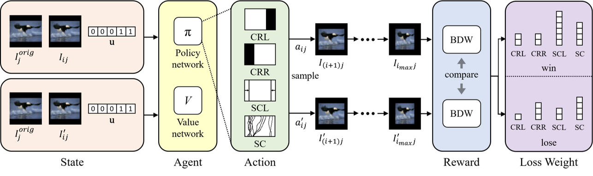

# Self-Play Reinforcement Learning for Fast Image Retargeting 
This is the official implementation of the [paper](https://arxiv.org/abs/2010.00909) in ACM Multimedia 2020.
We provide the sample codes for training and testing on image retargeting and sample retargeted results.

<p align="left">

</p>

## Notice
The experiments described in the paper used four actions including Seam Carving, but due to the license of Seam Carving, this implementation uses three actions except Seam Carving.
For the results of including Seam Carving in the actions, please refer to the paper and ```results/sample_RetargetMe```.

## Requirements
- Python 3.6
- Chainer 7.0
- ChainerRL 0.7
- opencv-python
- numpy

## Installation
1. Clone the repository.
  ```Shell
  git clone git@github.com:nobukatsu-kajiura/Self-Play-RL.git
  ```

2. Download [MIRFLICKR-1M Dataset](http://press.liacs.nl/mirflickr/mirdownload.html).
  We used 3,000 images in `images0.zip` for training.
  Put `images` directory in `$ROOT/dataset/`.

3. If you want to try the framework, download the trained model from [here](https://1drv.ms/u/s!Amw5GOOdpjbj9mUNk5ZzfwI1EZTo?e=7iQSZH) and put `model.npz` and `optimizer.npz` in `$ROOT/models/sample_3actions/`.

## Training and testing
1. Train the framework.
```Shell
python train.py --t-max 20 --beta 0.01 --lr 7e-4 --steps 5000 --eval-interval 1000 --eval-n-steps 150 --outdir models --batchsize 16 --action_num 3 --rate 0.025 --train_dataset dataset/MIRFLICKR_train.txt --valid_dataset dataset/MIRFLICKR_valid.txt
```
or
```Shell
bash train.sh
```
2. Test the framework.
```Shell
python test.py --t-max 20 --beta 0.01 --batchsize 16 --action_num 3 --rate 0.025 --target_rate 0.75 --test_dataset dataset/RetargetMe_test.txt --load models/sample_3actions
```
or
```Shell
bash test.sh
```

## Citation
If you find our research useful in your research, please consider citing:

    @inproceedings{kajiura2020self,
        title={Self-Play Reinforcement Learning for Fast Image Retargeting},
        author={Kajiura, Nobukatsu and Kosugi, Satoshi and Wang, Xueting and Yamasaki, Toshihiko},
        booktitle = {ACM Multimedia},
        year = {2020}
    }